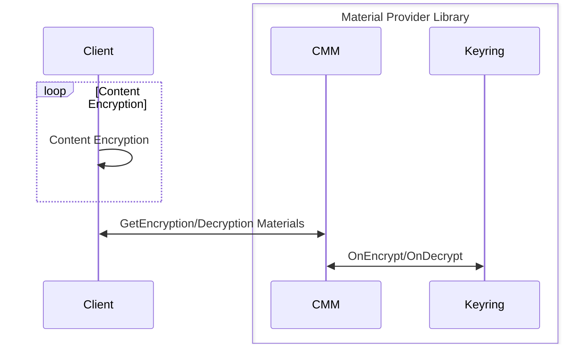

[//]: # "Copyright Amazon.com Inc. or its affiliates. All Rights Reserved."
[//]: # "SPDX-License-Identifier: CC-BY-SA-4.0"

# Adding a Metrics Interface

***NOTE: This document will be used to gain alignment on
this interface should look like and how it could be integrated with
existing operations. This document will not seek to specify
a Metrics implementation or specify which metrics will be collected
from impacted APIs or configurations.***

## Affected APIs or Client Configurations

This serves as a reference of all APIs and Client Configurations that this change affects.
This list is not exhaustive. Any downstream consumer of any API or client configuration SHOULD
also be updated as part of this proposed changed.

| API/ Configuration                                                                      |
| --------------------------------------------------------------------------------------- |
| [Encrypt](https://github.com/awslabs/aws-encryption-sdk-specification/blob/master/client-apis/encrypt.md) |
| [Decrypt](https://github.com/awslabs/aws-encryption-sdk-specification/blob/master/client-apis/decrypt.md) |
| [GetEncryptionMaterials](https://github.com/awslabs/aws-encryption-sdk-specification/blob/master/framework/cmm-interface.md#get-encryption-materials)|
| [DecryptionMaterials](https://github.com/awslabs/aws-encryption-sdk-specification/blob/master/framework/cmm-interface.md#decrypt-materials)|
| [OnEncrypt](https://github.com/awslabs/aws-encryption-sdk-specification/blob/master/framework/keyring-interface.md#onencrypt)|
| [OnDecrypt](https://github.com/awslabs/aws-encryption-sdk-specification/blob/master/framework/keyring-interface.md#ondecrypt)|
| [DynamoDB Table Encryption Config](https://github.com/aws/aws-database-encryption-sdk-dynamodb/blob/main/specification/dynamodb-encryption-client/ddb-table-encryption-config.md)|

## Affected Libraries

| Library  | Version Introduced  | Implementation |
| -------- | ------------------- | -------------- |
| ESDK     | T.B.D               | [ESDK.smithy](https://github.com/aws/aws-encryption-sdk/blob/mainline/AwsEncryptionSDK/dafny/AwsEncryptionSdk/Model/esdk.smithy)|
| MPL      | T.B.D               | [material-provider.smithy](https://github.com/aws/aws-cryptographic-material-providers-library/blob/main/AwsCryptographicMaterialProviders/dafny/AwsCryptographicMaterialProviders/Model/material-provider.smithy)|
| DB-ESDK  | T.B.D               | [DynamoDbEncryption.smithy](https://github.com/aws/aws-database-encryption-sdk-dynamodb/blob/main/DynamoDbEncryption/dafny/DynamoDbEncryption/Model/DynamoDbEncryption.smithy)|

## Definitions

### Conventions used in this document

The key words
"MUST", "MUST NOT", "REQUIRED", "SHALL", "SHALL NOT",
"SHOULD", "SHOULD NOT", "RECOMMENDED", "MAY", and "OPTIONAL"
in this document are to be interpreted as described in
[RFC 2119](https://tools.ietf.org/html/rfc2119).

## Summary

Existing users of Crypto Tools (CT) libraries do no have any insights as to
how the librar(y/ies) behave(s) in their application. 
This can lead to frustrating debugging sessions where users
are required to have explicit tests to assert they are using a particular feature
correctly, or if customers are using any of the KMS keyrings users have to have
AWS Cloudwatch open to verify their application is sending values users expect.
This can be seen as a best practice and users may find this a good exercise;
however, CT's libraries do not make debugging an easy task.

A feature which allows customers to get real-time telemetry of their application's 
integration with CT's libraries would be welcomed by users and will deliver on the
"easy to use and hard to misuse" tenet.

Introducing a new interface that defines the operations that must be
implemented in order to build a specification compliant MetricsAgent.

## Requirements

The interface should have three requirements.

1. MUST be simple.
1. MUST be extensible.

The following is documented to signify its importance
even though the interface is not able to make this guarantee.
Every implementation of the proposed interface must
ensure the following.

1. MUST NOT block the application's execution thread.

## Points of Integration

To collect metrics across CT's library stack multiple points of integration
are needed in order to collect metrics across CT's libraries.
Generally, CT's libraries work as follows:

*Note: Not every Client supports the Material Provider Library.
The Diagram below assumes it to help the mental model.*



To optionally emit metrics from a top level client,
all customer facing APIs MUST be changed to optionally accept
a Metrics Agent. This will allow customers to define and supply one top
level Metrics Agent; this agent will get plumbed throughout CT's stack.

For example, in the ESDK for Java this would look like:
```java
final AwsCrypto crypto = AwsCrypto.builder().build();
// Create a Keyring
final MaterialProviders matProv =
  MaterialProviders.builder()
      .MaterialProvidersConfig(MaterialProvidersConfig.builder().build())
      .build();

final IKeyring rawAesKeyring = matProv.CreateRawAesKeyring(keyringInput);
final Map<String, String> encryptionContext =
    Collections.singletonMap("ExampleContextKey", "ExampleContextValue");

// Create a Metrics Agent
final IMetricsAgent metrics = matProv.CreateSimpleMetricsAgent(metricsAgentInput);
// 4. Encrypt the data
final CryptoResult<byte[], ?> encryptResult =
    crypto.encryptData(rawAesKeyring, metrics, EXAMPLE_DATA, encryptionContext);
final byte[] ciphertext = encryptResult.getResult();
```

This change will allow Crypto Tools to introduce a Metrics Agent in a
non-breaking way as the Metrics Agent will be an optional parameter
at customer facing API call sites.

Currently, the ESDK client APIs models are defined [here](https://github.com/aws/aws-encryption-sdk/blob/mainline/AwsEncryptionSDK/dafny/AwsEncryptionSdk/Model/esdk.smithy#L60-L126).
This change would see that the client APIs be changed as follows:

```diff
structure EncryptInput {
  @required
  plaintext: Blob,

  encryptionContext: aws.cryptography.materialProviders#EncryptionContext,

  // One of keyring or CMM are required
  materialsManager: aws.cryptography.materialProviders#CryptographicMaterialsManagerReference,
  keyring: aws.cryptography.materialProviders#KeyringReference,

  algorithmSuiteId: aws.cryptography.materialProviders#ESDKAlgorithmSuiteId,

  frameLength: FrameLength,

+  metricsAgent: aws.cryptography.materialProviders#MetricsAgentReference
}
...
structure DecryptInput {
  @required
  ciphertext: Blob,

  // One of keyring or CMM are required
  materialsManager: aws.cryptography.materialProviders#CryptographicMaterialsManagerReference,
  keyring: aws.cryptography.materialProviders#KeyringReference,
  //= aws-encryption-sdk-specification/client-apis/keyring-interface.md#onencrypt
  //= type=implication
  //# The following inputs to this behavior MUST be OPTIONAL:
  // (blank line for duvet)
  //# - [Encryption Context](#encryption-context)
  encryptionContext: aws.cryptography.materialProviders#EncryptionContext,

+  metricsAgent: aws.cryptography.materialProviders#MetricsAgentReference
}
```