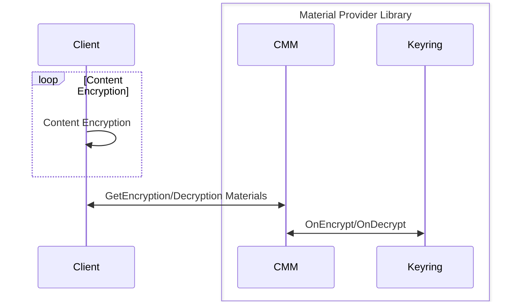

[//]: # "Copyright Amazon.com Inc. or its affiliates. All Rights Reserved."
[//]: # "SPDX-License-Identifier: CC-BY-SA-4.0"

# Adding a Metrics Interface

**_NOTE: This document will be used to gain alignment on
this interface should look like and how it could be integrated with
existing operations. This document will not seek to specify
a Metrics implementation or specify which metrics will be collected
from impacted APIs or configurations._**

## Affected APIs or Client Configurations

This serves as a reference of all APIs and Client Configurations that this change affects.
This list is not exhaustive. Any downstream consumer of any API or client configuration SHOULD
also be updated as part of this proposed changed.

| API/ Configuration                                                                                                                                                                |
| --------------------------------------------------------------------------------------------------------------------------------------------------------------------------------- |
| [Encrypt](https://github.com/awslabs/aws-encryption-sdk-specification/blob/master/client-apis/encrypt.md)                                                                         |
| [Decrypt](https://github.com/awslabs/aws-encryption-sdk-specification/blob/master/client-apis/decrypt.md)                                                                         |
| [GetEncryptionMaterials](https://github.com/awslabs/aws-encryption-sdk-specification/blob/master/framework/cmm-interface.md#get-encryption-materials)                             |
| [DecryptionMaterials](https://github.com/awslabs/aws-encryption-sdk-specification/blob/master/framework/cmm-interface.md#decrypt-materials)                                       |
| [OnEncrypt](https://github.com/awslabs/aws-encryption-sdk-specification/blob/master/framework/keyring-interface.md#onencrypt)                                                     |
| [OnDecrypt](https://github.com/awslabs/aws-encryption-sdk-specification/blob/master/framework/keyring-interface.md#ondecrypt)                                                     |
| [DynamoDB Table Encryption Config](https://github.com/aws/aws-database-encryption-sdk-dynamodb/blob/main/specification/dynamodb-encryption-client/ddb-table-encryption-config.md) |

## Affected Libraries

| Library | Version Introduced | Implementation                                                                                                                                                                                                     |
| ------- | ------------------ | ------------------------------------------------------------------------------------------------------------------------------------------------------------------------------------------------------------------ |
| ESDK    | T.B.D              | [ESDK.smithy](https://github.com/aws/aws-encryption-sdk/blob/mainline/AwsEncryptionSDK/dafny/AwsEncryptionSdk/Model/esdk.smithy)                                                                                   |
| MPL     | T.B.D              | [material-provider.smithy](https://github.com/aws/aws-cryptographic-material-providers-library/blob/main/AwsCryptographicMaterialProviders/dafny/AwsCryptographicMaterialProviders/Model/material-provider.smithy) |
| DB-ESDK | T.B.D              | [DynamoDbEncryption.smithy](https://github.com/aws/aws-database-encryption-sdk-dynamodb/blob/main/DynamoDbEncryption/dafny/DynamoDbEncryption/Model/DynamoDbEncryption.smithy)                                     |

## Definitions

### Conventions used in this document

The key words
"MUST", "MUST NOT", "REQUIRED", "SHALL", "SHALL NOT",
"SHOULD", "SHOULD NOT", "RECOMMENDED", "MAY", and "OPTIONAL"
in this document are to be interpreted as described in
[RFC 2119](https://tools.ietf.org/html/rfc2119).

## Summary

Existing users of Crypto Tools (CT) libraries do no have any insights as to
how the libraries behaves in their application.
This can lead to frustrating debugging sessions where users
are required to have explicit tests to assert they are using a particular feature
correctly, or if customers are using any of the KMS keyrings users have to have
AWS Cloudwatch open to verify their application is sending values users expect.
This can be seen as a best practice and users may find this a good exercise;
however, CT's libraries do not make debugging an easy task.

A feature which allows customers to get real-time telemetry of their application's
integration with CT's libraries would be welcomed by users and will deliver on the
"easy to use and hard to misuse" tenet.

Introducing a new interface that defines the operations that must be
implemented in order to build a specification compliant MetricsAgent.

## Requirements

The interface should have three requirements.

1. MUST be simple.
1. MUST be extensible.

The following is documented to signify its importance
even though the interface is not able to make this guarantee.
Every implementation of the proposed interface must
ensure the following.

1. MUST NOT block the application's execution thread.

## Points of Integration

To collect metrics across CT's library stack multiple points of integration
are needed in order to collect metrics across CT's libraries.
Generally, CT's libraries work as follows:

_Note: Not every Client supports the Material Provider Library.
The Diagram below assumes it to help the mental model._



To optionally emit metrics from a top level client,
all customer facing APIs MUST be changed to optionally accept
a Metrics Agent. This will allow customers to define and supply one top
level Metrics Agent; this agent will get plumbed throughout CT's stack.

For example, in the ESDK for Java this would look like:

**This example uses a simple metrics agent that the mpl provides to customers**

**This simple interface is simply a wrapper around a battle tested logging framework.**

_Note: The following code snippets show changes to the ESDK.
Please see the [Appendix](#appendix) for proposed changes to other libraries._

```java
final AwsCrypto crypto = AwsCrypto.builder().build();
// Create a Keyring
final MaterialProviders matProv =
  MaterialProviders.builder()
      .MaterialProvidersConfig(MaterialProvidersConfig.builder().build())
      .build();

final IKeyring rawAesKeyring = matProv.CreateRawAesKeyring(keyringInput);
final Map<String, String> encryptionContext =
    Collections.singletonMap("ExampleContextKey", "ExampleContextValue");

// Create a Metrics Agent
final IMetricsAgent metrics = matProv.CreateSimpleMetricsAgent(metricsAgentInput);
// 4. Encrypt the data
final CryptoResult<byte[], ?> encryptResult =
    crypto.encryptData(rawAesKeyring, metrics, EXAMPLE_DATA, encryptionContext);
final byte[] ciphertext = encryptResult.getResult();
```

This change will allow Crypto Tools to introduce a Metrics Agent in a
non-breaking way as the Metrics Agent will be an optional parameter
at customer facing API call sites.

Currently, the ESDK client APIs models are defined [here](https://github.com/aws/aws-encryption-sdk/blob/mainline/AwsEncryptionSDK/dafny/AwsEncryptionSdk/Model/esdk.smithy#L60-L126).
This change would see that the client APIs be changed as follows:

```diff
structure EncryptInput {
  @required
  plaintext: Blob,

  encryptionContext: aws.cryptography.materialProviders#EncryptionContext,

  // One of keyring or CMM are required
  materialsManager: aws.cryptography.materialProviders#CryptographicMaterialsManagerReference,
  keyring: aws.cryptography.materialProviders#KeyringReference,

  algorithmSuiteId: aws.cryptography.materialProviders#ESDKAlgorithmSuiteId,

  frameLength: FrameLength,

+ metricsAgent: aws.cryptography.materialProviders#MetricsAgentReference
}
...
structure DecryptInput {
  @required
  ciphertext: Blob,

  // One of keyring or CMM are required
  materialsManager: aws.cryptography.materialProviders#CryptographicMaterialsManagerReference,
  keyring: aws.cryptography.materialProviders#KeyringReference,
  //= aws-encryption-sdk-specification/client-apis/keyring-interface.md#onencrypt
  //= type=implication
  //# The following inputs to this behavior MUST be OPTIONAL:
  // (blank line for duvet)
  //# - [Encryption Context](#encryption-context)
  encryptionContext: aws.cryptography.materialProviders#EncryptionContext,

+ metricsAgent: aws.cryptography.materialProviders#MetricsAgentReference
}
```

## Issues and Alternatives

### Issue 0: Should Metric Agents be supported on client construction?

#### Yes

#### No

## Appendix

The following API changes are not complete. These changes assume that the new optional parameter is supplied to any additional downstream consumer that may or may not be listed here.

### MPL

#### CMM Operations

```diff
namespace aws.cryptography.materialProviders

use aws.polymorph#reference
use aws.polymorph#positional
use aws.polymorph#extendable
use aws.polymorph#javadoc
...
structure GetEncryptionMaterialsInput {
  //= aws-encryption-sdk-specification/framework/cmm-interface.md#encryption-materials-request
  //= type=implication
  //# The encryption materials request MUST include the following:
  //#
  //# - [Encryption Context](structures.md#encryption-context)
  //#   - The encryption context provided MAY be empty.
  //# - [Commitment Policy](./commitment-policy.md#supported-commitment-policy-enum)

  @required
  encryptionContext: EncryptionContext,

  @required
  commitmentPolicy: CommitmentPolicy,

  //= aws-encryption-sdk-specification/framework/cmm-interface.md#encryption-materials-request
  //= type=implication
  //# The encryption request MAY include the following:
  //#
  //# - [Algorithm Suite Id](algorithm-suites.md#algorithm-suite-id)
  //# - Required Encryption Context Keys - a set of strings.
  //# - Max Plaintext Length
  //#   - This value represents the maximum length of the plaintext to be encrypted
  //#     using the returned materials.
  //#     The length of the plaintext to be encrypted MUST not be larger than this value.

  algorithmSuiteId: AlgorithmSuiteId,

  maxPlaintextLength: Long,

  requiredEncryptionContextKeys: EncryptionContextKeys,

+ metricsAgent: aws.cryptography.materialProviders#MetricsAgentReference
}
...
structure DecryptMaterialsInput {
//= aws-encryption-sdk-specification/framework/cmm-interface.md#decrypt-materials-request
//= type=implication
//# The decrypt materials request MUST include the following:
//#
//# - [Algorithm Suite Id](algorithm-suites.md#algorithm-suite-id)
//# - [Commitment Policy](./commitment-policy.md#supported-commitment-policy-enum)
//# - [Encrypted Data Keys](structures.md#encrypted-data-keys)
//# - [Encryption Context](structures.md#encryption-context)
//#   - The encryption context provided MAY be empty.

  @required
  algorithmSuiteId: AlgorithmSuiteId,

  @required
  commitmentPolicy: CommitmentPolicy,

  @required
  encryptedDataKeys: EncryptedDataKeyList,

  @required
  encryptionContext: EncryptionContext,

  //= aws-encryption-sdk-specification/framework/cmm-interface.md#decrypt-materials-request
  //= type=implication
  //# The decrypt materials request MAY include the following:
  //#
  //# - [Reproduced Encryption Context](structures.md#encryption-context)

  reproducedEncryptionContext: EncryptionContext,

+ metricsAgent: aws.cryptography.materialProviders#MetricsAgentReference
}
```

#### Keyring Operations

```diff
namespace aws.cryptography.materialProviders

use aws.polymorph#reference
use aws.polymorph#positional
use aws.polymorph#extendable
use aws.polymorph#javadoc

use com.amazonaws.kms#EncryptionAlgorithmSpec
use aws.cryptography.materialProviders#CacheType

@extendable
resource Keyring {
  operations: [OnEncrypt, OnDecrypt]
}

// Keyring Structures

@reference(resource: Keyring)
structure KeyringReference {}
...
// Keyring Operations

//= aws-encryption-sdk-specification/framework/keyring-interface.md#onencrypt
//= type=implication
//# This interface MUST take [encryption materials](structures.md#encryption-materials) as input.
operation OnEncrypt {
  input: OnEncryptInput,
  output: OnEncryptOutput,
}

structure OnEncryptInput {
  @required
  materials: EncryptionMaterials,

+ metricsAgent: aws.cryptography.materialProviders#MetricsAgentReference
}

structure OnEncryptOutput {
  @required
  materials: EncryptionMaterials
}

//= aws-encryption-sdk-specification/framework/keyring-interface.md#ondecrypt
//= type=implication
//# This interface MUST take [decryption materials](structures.md#decryption-materials) and
//# a list of [encrypted data keys](structures.md#encrypted-data-key) as input.
operation OnDecrypt {
  input: OnDecryptInput,
  output: OnDecryptOutput,
}

structure OnDecryptInput {
  @required
  materials: DecryptionMaterials,

  @required
  encryptedDataKeys: EncryptedDataKeyList,

+ metricsAgent: aws.cryptography.materialProviders#MetricsAgentReference
}

structure OnDecryptOutput {
  @required
  materials: DecryptionMaterials
}
...
```

### S3EC

The S3EC does not have a smithy model, but its Java implementation
is the canonical implementation that the other language implementations
should base their implementations off of.

#### S3EncryptionClient

```diff
@Override
public PutObjectResponse putObject(PutObjectRequest putObjectRequest, RequestBody requestBody)
        throws AwsServiceException, SdkClientException {
          ...
}

+ public PutObjectResponse putObject(PutObjectRequest putObjectRequest, RequestBody requestBody, IMetricsAgent metricsAgent)
+        throws AwsServiceException, SdkClientException {
+          ...
+          ## Pass the IMetricsAgent reference to the appropriate downstream consumers
+}
...

@Override
public <T> T getObject(GetObjectRequest getObjectRequest,
                        ResponseTransformer<GetObjectResponse, T> responseTransformer)
        throws AwsServiceException, SdkClientException {
          ...
}

+public <T> T getObject(GetObjectRequest getObjectRequest,
+                        ResponseTransformer<GetObjectResponse, T> responseTransformer,
+                        IMetricsAgent metricsAgent)
+        throws AwsServiceException, SdkClientException {
+          ...
+          ## Pass the IMetricsAgent reference to the appropriate downstream consumers
+}
```

#### GetEncryptedObjectPipeline

```diff
...
public class GetEncryptedObjectPipeline {
    private final S3AsyncClient _s3AsyncClient;
    private final CryptographicMaterialsManager _cryptoMaterialsManager;
    private final boolean _enableLegacyUnauthenticatedModes;
    private final boolean _enableDelayedAuthentication;
    private final long _bufferSize;
    private final InstructionFileConfig _instructionFileConfig;
    private final CommitmentPolicy _commitmentPolicy;
+   private final IMetricsAgent _metricsAgent;

    public static Builder builder() {
        return new Builder();
    }

    private GetEncryptedObjectPipeline(Builder builder) {
        this._s3AsyncClient = builder._s3AsyncClient;
        this._cryptoMaterialsManager = builder._cryptoMaterialsManager;
        this._enableLegacyUnauthenticatedModes = builder._enableLegacyUnauthenticatedModes;
        this._enableDelayedAuthentication = builder._enableDelayedAuthentication;
        this._bufferSize = builder._bufferSize;
        this._instructionFileConfig = builder._instructionFileConfig;
        this._commitmentPolicy = builder._commitmentPolicy;
+       this._metricsAgent = builder._metricsAgentl
    }
    ...
}
```

#### PutEncryptedObjectPipeline

```diff
...
public class PutEncryptedObjectPipeline {
  final private S3AsyncClient _s3AsyncClient;
  final private CryptographicMaterialsManager _cryptoMaterialsManager;
  final private AsyncContentEncryptionStrategy _asyncContentEncryptionStrategy;
  final private ContentMetadataEncodingStrategy _contentMetadataEncodingStrategy;
  final private AlgorithmSuite _encryptionAlgorithm;
+  final private IMetricsAgent _metricsAgent;

  public static Builder builder() {
      return new Builder();
  }

  private PutEncryptedObjectPipeline(Builder builder) {
      this._s3AsyncClient = builder._s3AsyncClient;
      this._cryptoMaterialsManager = builder._cryptoMaterialsManager;
      this._asyncContentEncryptionStrategy = builder._asyncContentEncryptionStrategy;
      this._contentMetadataEncodingStrategy = builder._contentMetadataEncodingStrategy;
      this._encryptionAlgorithm = builder._encryptionAlgorithm;
+     this._metricsAgent = builder._metricsAgent;
  }
...
}
```

#### Keyring

```diff
package software.amazon.encryption.s3.materials;

import java.util.List;
public interface Keyring {
    EncryptionMaterials onEncrypt(final EncryptionMaterials materials);
+   EncryptionMaterials onEncrypt(final EncryptionMaterials materials, final IMetricsAgent metricsAgent);
    DecryptionMaterials onDecrypt(final DecryptionMaterials materials, final List<EncryptedDataKey> encryptedDataKeys);
+   DecryptionMaterials onDecrypt(final DecryptionMaterials materials, final List<EncryptedDataKey> encryptedDataKeys, final IMetricsAgent metricsAgent);
}
```

#### CryptographicMaterialsManager

```diff
package software.amazon.encryption.s3.materials;

public interface CryptographicMaterialsManager {
    EncryptionMaterials getEncryptionMaterials(EncryptionMaterialsRequest request);
+   EncryptionMaterials getEncryptionMaterials(EncryptionMaterialsRequest request, IMetricsAgent metricsAgent);
    DecryptionMaterials decryptMaterials(DecryptMaterialsRequest request);
+   DecryptionMaterials decryptMaterials(DecryptMaterialsRequest request, IMetricsAgent metricsAgent);
}
```
