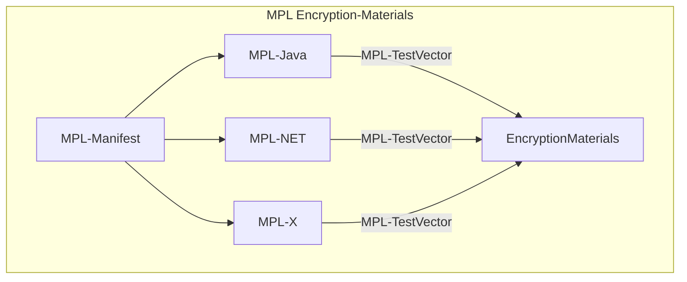
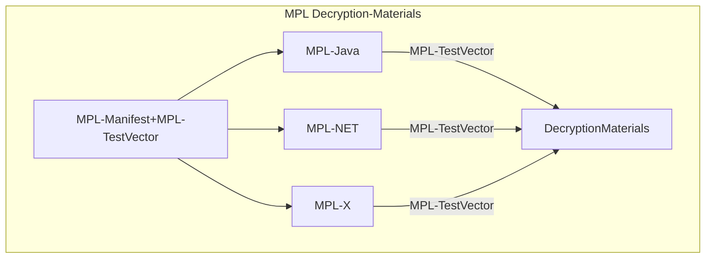
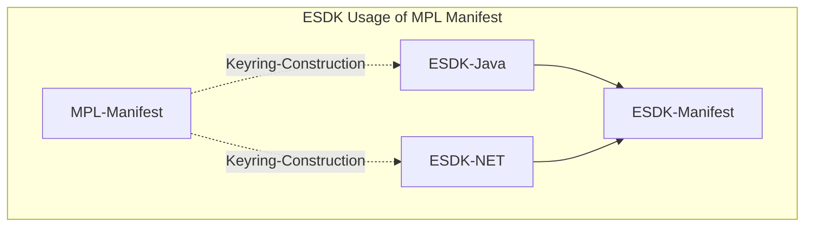

[//]: # "Copyright Amazon.com Inc. or its affiliates. All Rights Reserved."
[//]: # "SPDX-License-Identifier: CC-BY-SA-4.0"

## Summary

These test vectors are intended to be used to validate interoperability
across implementations of clients in a runtime,
for the AWS Crypto Tools AWS Cryptographic Material Providers Library (MPL).

They are composed of JSON manifest files that define one or more test cases,
including sufficient information to process each test case.
These manifest files can also identify additional resources needed for a given test case.
These resources will be identified with a URI.
If identifying a local file, the URI will be a relative path from the manifest file's
parent directory to the target file.

Every manifest type definition must include a unique type name that will be used by
test vector handlers to identify the manifest type.

See https://github.com/awslabs/aws-crypto-tools-test-vector-framework for additional information.
This framework is much of the motivation for this work.

The manifest is meant to produce encryption and decryption materials that every
runtime implementation can process and produce the desired output for that test vector.

These test vectors are not meant to be processed by a top level client library like
the AWS Encryption SDK or the AWS Database Encryption SDK. However; they may be able
to use the manifest to see how to construct keyrings that they can use in their test
vectors.

## Glossary

- **Test Vector** : Information about a single test case. Used to either process existing data
  or create new data.
- **Test Vector Manifest** : A document that describes one or more test vectors.

## Out of Scope

This file is not a definition or description of any specific type of test vector or manifest.

## Motivation

The AWS Crypto Tools team has built several tools that require multiple implementations.
Interoperability between these implementations and runtimes is critical.
To ensure that these implementations are actually interoperable,
we needed to define test vectors that would allow validation
of various aspects of these tools.
As we built more tools and required more types of test vectors,
it became evident that there would be value in defining an extensible framework
for defining many different types of test vectors to avoid having to reinvent the wheel
for every client.

We also need to be able to maintain backwards compatibility.
By producing manifests that can be stored
we can ensure that new clients can decrypt old messages.

The latest version of the MPL being written in Dafny
and much of the design requirements are proven by Dafny specifications.
These specifications are valuable but having empirical tests
makes this proof even stronger.
Because you can write and prove a specification
but it may not be correct.
This is especially true for backwards compatibility.
But even for code reviews and understanding the impact of a change,
looking at how test vectors are created helps reason about the edge cases of a change.

## Drawbacks

Not every configuration can be practically tested.
See [test vector enumeration](test-vector-enumeration.md#selecting-a-representative-input-value) for details.

We will need to write minimal clients in every language with which we want to use these test
vectors to understand the manifests described in subsequent features.

This should represent acceptable overhead: we would need to write some amount of code for each
language to handle the test vectors anyway and this framework lets us define a consistent
way of handling those test vectors while remaining simple to process.

Additionally, using Dafny can lower this overhead.
The challenge now is to compose the proper level of reusability.
The MPL is the base library for many encryption clients
and there may be some work to be able to reuse parts of these test vectors
in other libraries.
